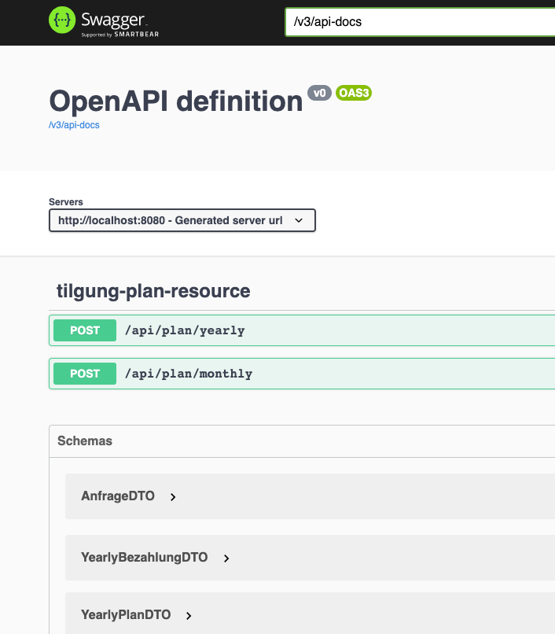

# Emi-calculator buil with ReactJS and Spring Boot(German)

A fullstack application that calculates the amount of remaining debt after ,X, Amount of years based on:

1. Initial loan Amount.(Darlehensbetrag)
2. Interest Rate.(Sollzinssatz)
3. Yearly Amortization % rate.(Anfängliche Tilgung (%))
4. Optional -- Initial duration till which the interest rate doesn't change.(Zinsbindungsdauer).

## Frontend 
Based on ReactJS.The Frontend is reponsive and reactive, that is it can be run and shown without problem on all mobile and non-destop devices
and the change in input parameters reflects dynamically the output table in the UI.
 

## Backend
Based on Spring boot, Java 8, Swagger documentation and AOP logging.

 

## Api Endpunkten
- http://localhost:8080/api/plan/monthly
- http://localhost:8080/api/plan/yearly
jeweils für monatliche und jährliche Planberechnungen.

## Swagger
- http://localhost:8080/api-docs.html

## Getting Started

These instructions will get you a copy of the project up and running on your local machine for development and testing purposes. See deployment for notes on how to deploy the project on a live system.

## Prerequisites

As both frontend and backend parts are going to be running in docker container. You need to have docker installed on your system. 
https://docs.docker.com/get-docker/

## Deployment(How to run)

From root directory of the project run

#### docker-compose up -d (if needed use sudo!)

Wait a few minutes till both backend and frontend containers are up and running. 

After the containers are up, you can access the application at:

http://localhost:3000

## Contributing

Please read [CONTRIBUTING.md](https://gist.github.com/PurpleBooth/b24679402957c63ec426) for details on our code of conduct, and the process for submitting pull requests to us.

## Authors

* **Anirudh**

See also the list of [contributors](https://github.com/your/project/contributors) who participated in this project.

## License

This project is licensed under the MIT License - see the [LICENSE.md](LICENSE.md) file for details
